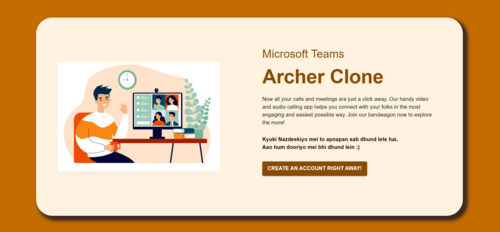

# MS Teams - Archer Clone

**Hosted App:** https://arcane-escarpment-21812.herokuapp.com/

**Demo Video:** https://youtu.be/KGYTuPF0q70

This is a Fully Functional Real Time Video Calling Web
Application with Chat Application and User Authentication that I
created using the SCRUM framework of Agile Software Development.
I created this project as a part of the Microsoft Engage 2021
mentorship program.

## Features 📝

- Group Video Call of Four Individuals
- Chat Application accessed before, during and after the Call
- User Authentication via Mail
- Screen Presentation during Call
- Automated Mail invites from the Application
- List of Participants in the room
- Audio & Video Toggles

## Tech Stack 💻

**Client:** [React.js](https://reactjs.org/)

- Video Call & Present Screen : [Socket.io](https://socket.io/), [Simple-Peer](https://www.npmjs.com/package/simple-peer)
- Chat Feature : [Firestore](https://firebase.google.com/products/firestore?gclid=Cj0KCQjwiqWHBhD2ARIsAPCDzalOXhEYzt4WRYZadZZq8We9PwMK_QseRaS81MP0Mk4qodCj_x8sIAwaArUnEALw_wcB&gclsrc=aw.ds)
- User Authentication : [Firebase Authentication](https://firebase.google.com/products/auth?gclid=Cj0KCQjwiqWHBhD2ARIsAPCDzamR-zFkY4KxFnIb05vsM9HmkRAUVi6xsracUWSpi2vS6gCfYBRdcJYaAn-vEALw_wcB&gclsrc=aw.ds)
- Mail Invites : [Email.js](https://www.emailjs.com/)
- Styling : [Material UI](https://material-ui.com/)

**Server:** [Node.js](https://nodejs.org/en/), [Express.js](https://expressjs.com/)

**Deployment:** [Heroku](https://devcenter.heroku.com/articles/git)

## Run Locally

For running the application locally, all you need are 4 simple steps!

- Node Installation
- Yarn installation
- Cloning repository
- Run!

**1. Node Installation**

- Node installation on Windows

  Just go on [official Node.js website](https://nodejs.org/) and download the installer. Also, be sure to have `git` available in your PATH, `npm` might need it (You can find git [here](https://git-scm.com/)).

- Node installation on Ubuntu

  You can install nodejs and npm easily with apt install, just run the following commands.

      $ sudo apt install nodejs
      $ sudo apt install npm

- Other Operating Systems
  You can find more information about the installation on the [official Node.js website](https://nodejs.org/) and the [official NPM website](https://npmjs.org/).

If the installation was successful, you should be able to run the following command.

    $ node --version
    v8.11.3

    $ npm --version
    6.1.0

If you need to update `npm`, you can make it using `npm`! Cool right? After running the following command, just open again the command line and be happy.

    $ npm install npm -g

###

**2. Node Installation**

After installing node, this project will need yarn too, so just run the following command.

    $ npm install -g yarn

###

**3. Cloning the Repository**

    $ git clone https://github.com/archer1712/MS-Teams-Archer-Clone.git
    $ cd MS-Teams-Archer-Clone
    $ yarn install

###

**4. Run!**

To make the production variable false, remove `PROD=true`
in _start_ under _scripts_ in `package.json`. Also, replace
`'https://arcane-escarpment-21812.herokuapp.com'` with `'/'`
at Line 143 in `client\src\routes\Room.js`. Then run the following commands!

    $ yarn start
    $ cd client
    $ yarn start

That's it. Go to `http://localhost:3000/` to begin right away!

## Demo

As you open the link to the app or run it locally, you'll come
across a front page. To begin, click on the *create an account
right away* button. 

If you're visiting the page for the first time, or want to create
a new account, add your email id and choose a random password.
Also add the password again to confirm, and then click on sign in.
If you already have an account, click on the *Already have an 
account* link.

After this, you will be redirected to the LogIn page. Fill in 
your first name, email id with which you created an account and 
your password. 

If you don't remember the password, click on the *Forgot Password*
link and you will be redirected to that page. Type in the email id
with which you created an account.

Now go to your inbox. You might have received the following mail
from the Archer Clone Team. Click on the link and you'll be provided
with an option to change your password. Now go back to *Already 
have an account* and fill in your new password and you'll be logged
in!

After logging in, you reach the dashboard.
To create a new room click on the **Create A Room** button and
you'll be redirected to the new room.

To invite over other friends in this room, send them the room code.
You can get the MSAC room code from the url bar itself. It is 
the part of the link right after *chatview/* or *room/*. See the
picture below!

For joining a room, click on the join a room button in the dropdown
of the dashboard. You will be asked for the MSAC room code. Add the
code which is explained above and click on the **Join Room** button.

On the left side, you see the list of participants present in the
room currently. On the right hand side, you can see the chatbox.
Go ahead and type in the messages you wanna send to your team.
you can also use the emojis by clicking on the 😃 button on the 
left of the message input and choose the emojis you want to add. 
Then click on the send button on the right.

For joining the video call, click on the **Join Video Call** 
button on the bottom right corner.

When you enter the video call, you'll see your teams video along
with yours on the screen. Make sure that more than four people
dont join because the room will be filled. On the bottom, you
might see some buttons.

**Audo/Video Toggle:** You can stop sharing your audio or video and start sharing them again as you like using these buttons.

**Share Screen:** For sharing your screen click on the button as shown below and then select the tab and press on share. For stop sharing you can click on the same button again.

**Get Call Link:** If you haven't invited your friends yet click on the Info button and then the *copy* button to copy the link to the call on your clipboard. Now you can send it to your friends and ask them to simply login the app and go to the link and they'll be joining your call soon.

**Mail Invite:** For sending invites directly, go to the *Invite* button, type in the mail id to whom you wanna send the invite and click on *Send Invite* and the person will receive the link to the call.

**End Call:** For ending the call, click on the end call button. You'll be  redirected to the chat. 

**Log Out:** For loggint out click on the logout button on the top right corner of the screen.

## FAQ

#### How many of my friends can join?

A total of 4 people including you can join the call.

#### How to invite my friends or team on the call?

- You can copy the link to the call and send invite
- You can copy the link using the Info button
- You can put in the Mail ids and send invite directly using the invite button

#### How to get the MSAC room code for the call?

It is the part of the link after the `room/` or `chatview/` in the URL of the call.
For instance, if the link of the room is `https://arcane-escarpment-21812.herokuapp.com/chatview/d96e9a60-e21f-11eb-a5bf-b1df2269175d`
then the MSAC Room Code will be `d96e9a60-e21f-11eb-a5bf-b1df2269175d`

## Troubleshooting

**Not able to enter the video call** : If you are unable to enter the video
call page and the security settings on the URL Bar shows *Not Secure*, try to close all the 
other tabs and then enter the room.

Hope you enjoy using the application. 

Cheers 🍻

